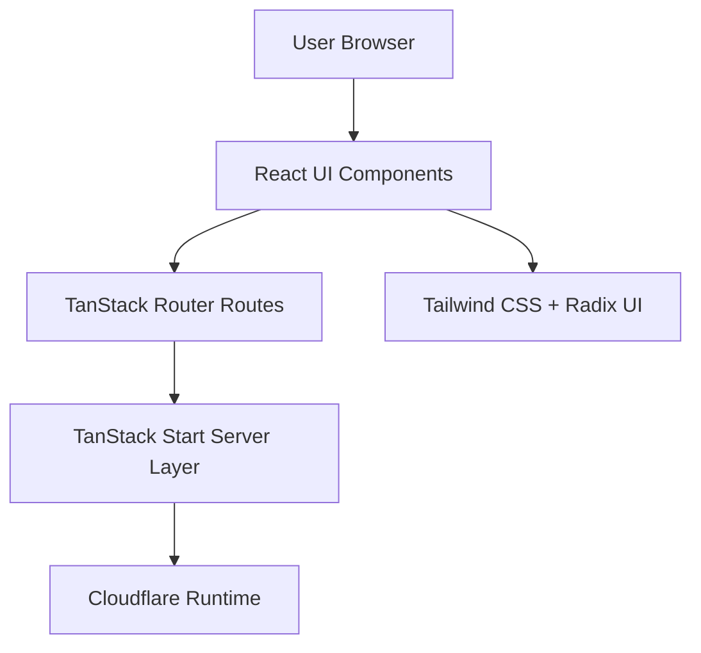

# Aditya Bhatt Portfolio


A modern personal portfolio website built with TanStack Start, React, TypeScript, and Tailwind CSS.  
It highlights experience, projects, skills, notes, and contact details in a clean and responsive layout.

## Tech Stack


## Project Architecture



## Getting Started

### 1) Prerequisites

- Node.js 20+ recommended
- npm 10+ recommended

### 2) Install dependencies

```bash
npm install
```

### 3) Run development server

```bash
npm run dev
```

### 4) Build for production

```bash
npm run build
```

### 5) Preview production build

```bash
npm run preview
```

## Useful Scripts

- `npm run dev` - Start local development server
- `npm run build` - Build production assets
- `npm run preview` - Preview production build locally
- `npm run lint` - Run ESLint checks
- `npm run format` - Format project files with Prettier

## Folder Highlights

- `src/routes` - Route definitions and page-level metadata
- `src/components` - Portfolio sections and reusable UI blocks
- `src/components/ui` - Shared UI primitives
- `src/lib` - Utility and error-handling helpers
- `src/styles.css` - Global styles and theme tokens

## Deployment

This project is configured for Cloudflare-style deployment runtime and can also be hosted on any platform that supports Vite/TanStack Start output.

